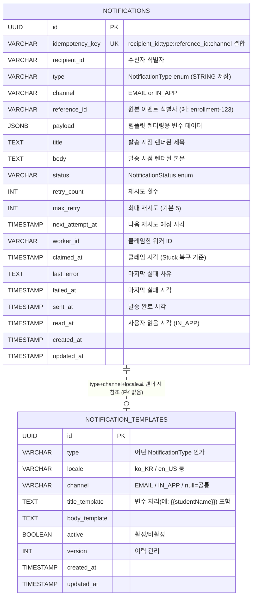

# ERD (Entity Relationship Diagram)

본 문서는 알림 발송 시스템의 데이터 모델을 정의한다.

---

## 1. 다이어그램



> **관계 메모**: `notifications.type`은 `notification_templates.type`을 논리적으로 참조하지만 **DB 외래키는 두지 않는다**. 템플릿은 운영 중 비활성/삭제될 수 있고, 알림은 발송 시점에 이미 렌더된 결과(title/body)를 보관하기 때문에 템플릿 부재가 알림 무결성을 깨지 않는다.

---

## 2. notifications 테이블 상세

### 컬럼 그룹

| 그룹 | 컬럼 | 역할 |
|------|------|------|
| **식별** | `id`, `idempotency_key` | 시스템 식별자 + 비즈니스 식별자 (대리키 + 자연키 분리) |
| **수신자/분류** | `recipient_id`, `type`, `channel`, `reference_id` | 누구한테, 어떤 종류, 어떤 채널, 어떤 이벤트 |
| **메시지** | `payload`, `title`, `body` | 변수 데이터 + 렌더 결과 (Hybrid 패턴) |
| **상태** | `status`, `retry_count`, `max_retry`, `next_attempt_at` | 생애주기 + 재시도 정책 |
| **클레임/복구** | `worker_id`, `claimed_at` | 다중 워커 환경 + Stuck 복구 |
| **실패 추적** | `last_error`, `failed_at` | 디버깅 |
| **처리 시각** | `sent_at`, `read_at` | 발송 시각, 사용자 읽음 시각 |
| **감사** | `created_at`, `updated_at` | 자동 관리 |

### 핵심 제약

- `id` UUID PRIMARY KEY (자동 인덱스)
- `idempotency_key` UNIQUE NOT NULL (자동 인덱스, 멱등성 보장)
- `status`, `type`, `channel` NOT NULL (필수)

### 인덱스

| 이름 | 정의 | 용도 |
|------|------|------|
| (자동) PK | `(id)` | 단일 행 조회 |
| (자동) UNIQUE | `(idempotency_key)` | 멱등성 체크 |
| `idx_recipient_created` | `(recipient_id, created_at DESC)` | 사용자 알림 목록 |
| `idx_pending_polling` | `(next_attempt_at) WHERE status='PENDING'` | 워커 폴링 (Partial) |
| `idx_stuck_reaper` | `(claimed_at) WHERE status='PROCESSING'` | Stuck Reaper (Partial) |

→ 폴링/Reaper용 인덱스는 **PostgreSQL Partial Index**로 설계해 인덱스 크기를 약 1/100로 줄였다. 자세한 이유는 [design-decisions.md](./design-decisions.md) 참조.

---

## 3. notification_templates 테이블 상세

알림 type / locale / channel별 메시지 템플릿. 변수는 `{{name}}` 형식으로 표기 (Mustache 스타일).

### 핵심 제약

- `id` UUID PRIMARY KEY
- `UNIQUE (type, locale, channel)` — 같은 (타입, 언어, 채널) 조합엔 활성 템플릿 1개

### 시드 데이터 예시

| type | locale | channel | title_template | body_template |
|------|--------|---------|-----------------|---------------|
| `ENROLLMENT_COMPLETED` | `ko_KR` | null (공통) | 수강 신청이 완료되었습니다 | {{studentName}}님, {{courseName}} 강의 신청이 완료되었습니다. |
| `PAYMENT_CONFIRMED` | `ko_KR` | null | 결제가 완료되었습니다 | {{amount}}원 결제가 완료되었습니다. |
| `CLASS_STARTS_TOMORROW` | `ko_KR` | null | 내일 강의가 시작됩니다 | {{courseName}} 강의가 내일 시작됩니다. |
| `ENROLLMENT_CANCELLED` | `ko_KR` | null | 수강 신청이 취소되었습니다 | {{courseName}} 수강 신청이 취소되었습니다. |

→ Phase 3의 Flyway `V2__notification_templates.sql`에서 INSERT.

---

## 4. 데이터 흐름 (요약)

```
[API: POST /notifications]
   ↓
[멱등성 키 생성: recipient_id:type:reference_id:channel]
   ↓
[notifications INSERT (status=PENDING, payload, ...)]
   - UNIQUE 충돌 → 기존 행 반환 (멱등 보장)
   ↓
[비동기 워커: idx_pending_polling 인덱스로 PENDING 조회]
   ↓
[워커가 클레임: status PROCESSING, worker_id, claimed_at]
   ↓
[notification_templates 조회 + payload로 렌더]
   ↓
[title, body 컬럼 채움 + EMAIL이면 SMTP 호출]
   ↓
[성공: status=SENT, sent_at 기록 / 실패: status=FAILED, 재시도 또는 DEAD_LETTER]

[별도 Reaper 스케줄러]
   ↓
[idx_stuck_reaper 인덱스로 PROCESSING + 오래 머문 행 조회]
   ↓
[PENDING으로 복구]

[조회 API: GET /notifications/users/{id}]
   ↓
[idx_recipient_created 인덱스로 빠른 조회]
   ↓
[저장된 title/body 그대로 응답 — 렌더링 없음]
```

---

## 5. 설계 결정 요약

- **PK**: UUID v4 (대리키)
- **idempotency_key**: 자연키, UNIQUE 제약으로 멱등성 보장
- **메시지**: Hybrid 패턴 (payload + 렌더된 title/body 둘 다 저장)
- **상태 머신**: PENDING / PROCESSING / SENT / FAILED / DEAD_LETTER (5 states)
- **인덱스**: 자주 쓰는 쿼리 3개에 Partial Index 활용

자세한 결정 배경은 [design-decisions.md](./design-decisions.md), 상태 머신은 [state-machine.md](./state-machine.md) 참조.
