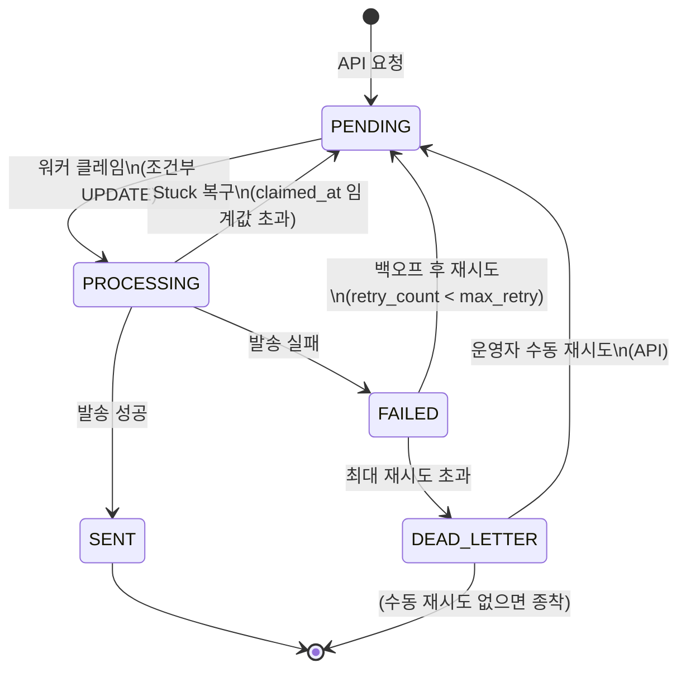

# Notification 상태 머신

알림 한 건이 등록부터 종착까지 거치는 상태와 전이 규칙을 정리합니다. 5개 상태(PENDING / PROCESSING / SENT / FAILED / DEAD_LETTER)와 도메인 메서드 기반 전이로 구현했습니다.

---

## 1. 상태 다이어그램



---

## 2. 상태 정의

| 상태 | 의미 | 진입 시점 |
|------|------|----------|
| **PENDING** | 발송 대기 중 (워커가 가져갈 수 있음) | API로 알림 등록 시 / FAILED에서 재시도 / DEAD_LETTER에서 수동 재시도 / PROCESSING이 Stuck 복구됨 |
| **PROCESSING** | 워커가 클레임해 처리 중 | 워커가 PENDING을 가져갈 때 |
| **SENT** | 발송 완료 (종착 상태) | 워커가 발송 성공 시 |
| **FAILED** | 발송 실패 (재시도 대기 또는 DEAD_LETTER 전이) | 워커가 발송 실패 시 |
| **DEAD_LETTER** | 최대 재시도 초과 (운영자 개입 필요) | retry_count ≥ max_retry 도달 시 |

---

## 3. 상태 전이 규칙

### 허용 전이

| # | 현재 상태 | 다음 상태 | 트리거 | 기록되는 정보 |
|---|----------|----------|--------|-------------|
| 1 | (초기) | PENDING | API 알림 등록 | created_at, payload 등 |
| 2 | PENDING | PROCESSING | 워커 클레임 | worker_id, claimed_at |
| 3 | PROCESSING | SENT | 발송 성공 | sent_at, title, body 렌더 결과 |
| 4 | PROCESSING | FAILED | 발송 실패 (예외) | last_error, failed_at, retry_count++ |
| 5 | PROCESSING | PENDING | Stuck 복구 (Reaper) | worker_id, claimed_at 리셋 |
| 6 | FAILED | PENDING | 백오프 시간 경과 + retry_count < max_retry | next_attempt_at 갱신 |
| 7 | FAILED | DEAD_LETTER | retry_count ≥ max_retry | failed_at |
| 8 | DEAD_LETTER | PENDING | 운영자 수동 재시도 API | retry_count 정책에 따라 |

### 금지 전이 (시도 시 예외)

- `SENT → *` : 종착 상태, 어떤 전이도 불허
- `PROCESSING → DEAD_LETTER` : 단순화 — FAILED를 거쳐야 함
- `PENDING → SENT` : PROCESSING을 거쳐야 함
- `DEAD_LETTER → PENDING` (자동) : 자동 전이는 없음, 수동 API로만 허용

---

## 4. 핵심 시나리오별 흐름

### 시나리오 A: 정상 발송

```
[API 요청] → PENDING
[워커 클레임] → PROCESSING
[발송 성공] → SENT (종착)
```

### 시나리오 B: 일시 실패 후 성공

```
[API 요청] → PENDING
[워커 클레임 1차] → PROCESSING → [SMTP 일시 장애] → FAILED (retry_count=1)
   ↓ RetryProcessor 5초 후 폴링
   ↓ 백오프 계산: 10초 + jitter(0~5초) = 10~15초
[scheduleRetry: PENDING, next_attempt_at = 미래 시각]
   ↓ next_attempt_at 도달 후 발송 워커 폴링
[워커 클레임 2차] → PROCESSING → [발송 성공] → SENT
```

### 시나리오 C: 영구 실패 (DEAD_LETTER)

```
[API 요청] → PENDING → PROCESSING → FAILED (retry_count=1)
   → 백오프 10~15초 → PENDING → PROCESSING → FAILED (retry_count=2)
   → 백오프 20~25초 → ... (백오프 매번 2배 증가)
   → PROCESSING → FAILED (retry_count=5 = max_retry)
   → RetryProcessor가 canBeRetried() false 판단
   → moveToDeadLetter → DEAD_LETTER (자동 처리 종료)
```

자세한 백오프 공식과 파라미터는 [async-design.md](./async-design.md#재시도-정책--exponential-backoff--jitter) 참조.

### 시나리오 D: 워커 크래시 (Stuck 복구)

```
[API 요청] → PENDING → PROCESSING (worker_id=W1, claimed_at=10:00)
[워커 W1 프로세스 죽음 — OOM/k8s evicted/재시작 등]
   → claimed_at 그대로 멈춤, 어떤 워커도 안 건드림
       (NotificationProcessor는 PENDING만 보고, RetryProcessor는 FAILED만 봄)

[StuckReaperProcessor가 10:05~10:06 사이 폴링]
   → idx_stuck_reaper로 PROCESSING + claimed_at < (NOW - 5분) 발견
[recoverFromStuck → PENDING, worker_id/claimed_at null]
   → retry_count는 변경 X (인프라 사고와 외부 시스템 사고를 다르게 처리)
[다른 워커가 다시 폴링해 잡음] → 재발송 시도
```

retry_count를 안 건드리는 이유: stuck은 외부 시스템 장애가 아닌 인프라 장애. 재시도 카운트를 증가시키면 인프라가 불안정한 시기에 stuck 누적으로 DEAD_LETTER로 보내져 외부 시스템 한 번도 거치지 않은 알림이 영구 실패 처리되는 사고가 납니다. 자세한 정책 근거는 [async-design.md](./async-design.md#stuck-복구) 참조.

### 시나리오 E: 운영자 수동 재시도

```
[알림이 DEAD_LETTER로 종착]
[운영자가 admin API 호출: POST /admin/notifications/{id}/retry]
[DEAD_LETTER → PENDING, retry_count는 정책에 따라 초기화 또는 유지]
[정상 흐름으로 복귀]
```

---

## 5. 구현 방식: 도메인 메서드

Java 도메인 메서드 + enum으로 구현했습니다. Spring StateMachine 같은 외부 라이브러리는 사용하지 않았습니다. 상태 5개와 단순 전이라 도메인 메서드만으로 충분히 명확하고, 라이브러리는 대출 심사처럼 상태 수십 개 + 복잡한 가드/액션 워크플로에 어울리는 도구입니다.

```java
public enum NotificationStatus {
    PENDING, PROCESSING, SENT, FAILED, DEAD_LETTER
}

@Entity
public class Notification {
    private NotificationStatus status;

    public void startProcessing(String workerId) {
        if (status != PENDING) {
            throw new IllegalStateTransitionException(status, PROCESSING);
        }
        this.status = PROCESSING;
        this.workerId = workerId;
        this.claimedAt = LocalDateTime.now();
    }

    public void markAsSent() { /* PROCESSING → SENT */ }
    public void markAsFailed(String reason) { /* PROCESSING → FAILED */ }
    public void scheduleRetry(LocalDateTime nextAttempt) { /* FAILED → PENDING */ }
    public void moveToDeadLetter() { /* FAILED → DEAD_LETTER */ }
    public void recoverFromStuck() { /* PROCESSING → PENDING (Reaper) */ }
    public void manualRetry() { /* DEAD_LETTER → PENDING */ }
}
```

잘못된 전이 시도는 `ensureStatus()` 가드에서 `IllegalStateTransitionException`으로 즉시 차단합니다. 비즈니스 룰을 도메인 객체에 캡슐화한 Rich Domain Model 패턴.

---

## 6. 읽음 처리 (별도 차원)

알림의 "발송 상태"와 "사용자 읽음"은 별도 차원입니다.

- `status`: 시스템의 발송 라이프사이클 (PENDING~DEAD_LETTER)
- `read_at`: 사용자가 알림 페이지 조회 시 기록되는 timestamp (nullable)

EMAIL은 보통 `read_at`이 NULL로 유지됩니다 (외부 클라이언트에서 읽기 때문에 추적 불가). IN_APP은 사용자가 알림 페이지를 열거나 명시적으로 읽음 처리 시 기록됩니다.

→ 자세한 근거는 [design-decisions.md](./design-decisions.md) 참조.

---

## 7. 운영 파라미터 (실제 적용된 값)

| 파라미터 | 값 | 컴포넌트 |
|---------|-----|---------|
| `max_retry` | 5 | Notification 엔티티 컬럼 (`DEFAULT_MAX_RETRY`) |
| Stuck 임계값 | 5분 (300초) | `notification.reaper.stuck-threshold-seconds` |
| StuckReaper 주기 | 1분 | `notification.reaper.polling-interval-ms` |
| 발송 워커 폴링 주기 | 1초 | `notification.worker.polling-interval-ms` |
| 재시도 워커 폴링 주기 | 5초 | `notification.retry.polling-interval-ms` |
| 재시도 백오프 base | 10초 | `notification.retry.base-delay-seconds` |
| 재시도 백오프 multiplier | 2 | `notification.retry.multiplier` |
| 재시도 백오프 max | 5분 (300초) | `notification.retry.max-delay-seconds` |
| 재시도 jitter | 0~5초 | `notification.retry.jitter-seconds` |
| 발송 배치 크기 | 10 | `notification.worker.batch-size` |
| 재시도 배치 크기 | 20 | `notification.retry.batch-size` |
| Reaper 배치 크기 | 50 | `notification.reaper.batch-size` |

모든 파라미터는 `application.yaml`에서 외부화. 운영에서 트래픽 측정 후 코드 수정 없이 조정 가능. 자세한 설명은 [async-design.md](./async-design.md) 참조.
